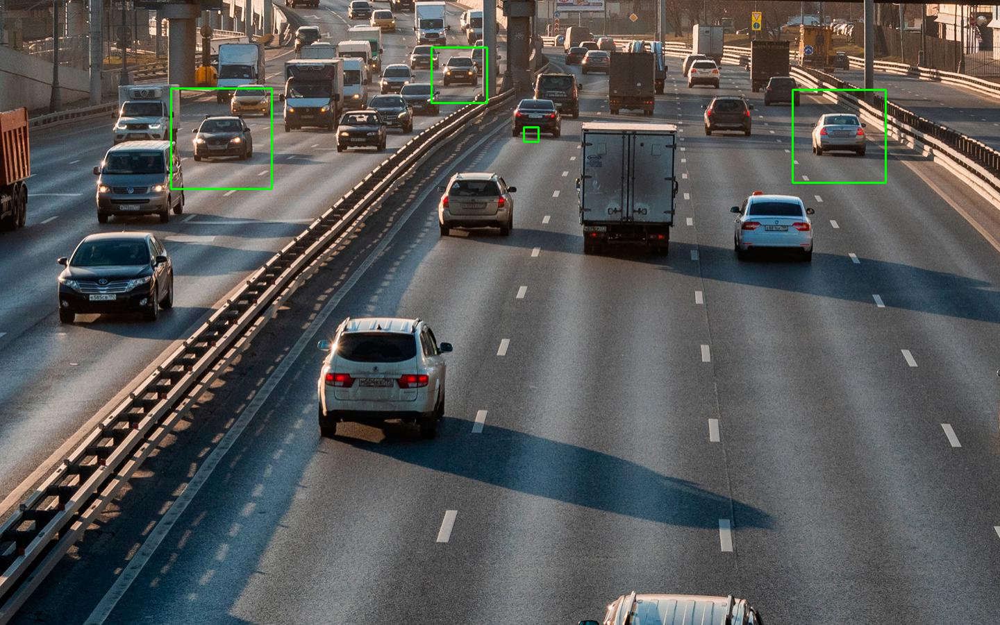
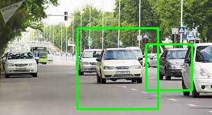
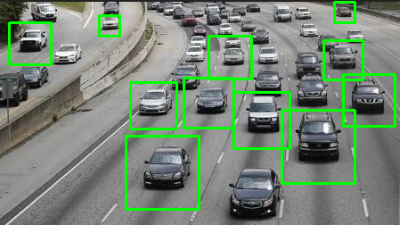
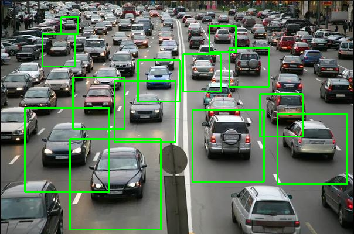

### Отчет по первой лабораторной работе:
 В качестве объекта который будет обнаруживать программа на изображениях был выбран автомобиль. Классифатор для автомобилей был взят из открытого доступа : [источник](https://gist.github.com/199995/37e1e0af2bf8965e8058a9dfa3285bc6)

#### результат обработки изображения 1

#### результат обработки изображения 1

#### результат обработки изображения 1

#### результат обработки изображения 1

